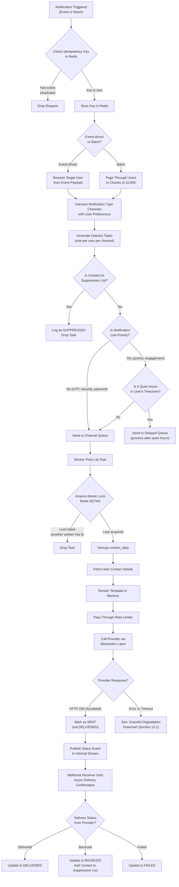
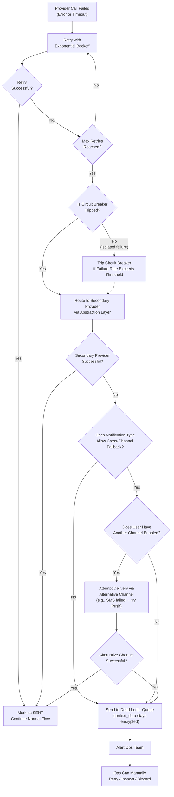
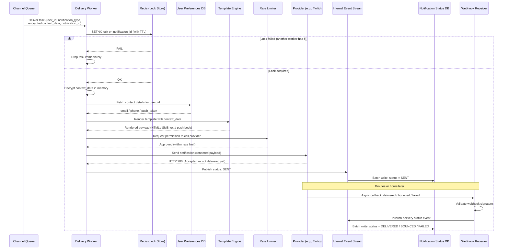
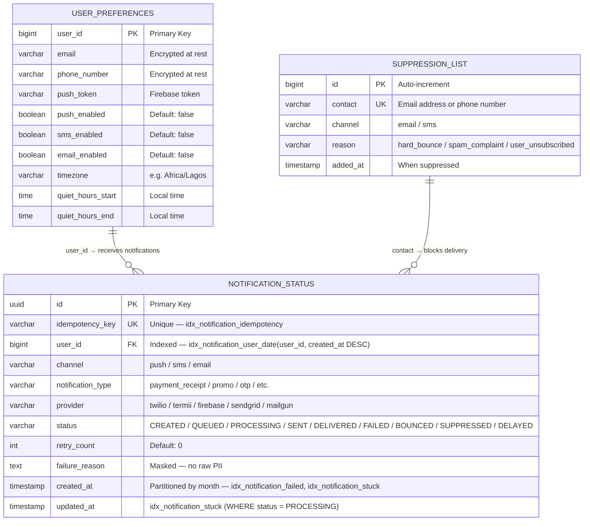

# Technical Specification: Multi-Channel Notification System

**Author:** Abdulmalik Alayande  
**Date:** May 31, 2026  

---

## Table of Contents

- [1. Overview](#1-overview)
- [2. Problem Statement](#2-problem-statement)
- [3. Goals and Non-Goals](#3-goals-and-non-goals)
- [4. High-Level Architecture](#4-high-level-architecture)
  - [4.1 The Embedded Library Paradigm](#41-the-embedded-library-paradigm)
- [5. Component Breakdown](#5-component-breakdown)
  - [5.1 Ingestion Layer](#51-ingestion-layer)
  - [5.2 Resolution and Routing Layer](#52-resolution-and-routing-layer)
  - [5.3 Suppression and Compliance Layer](#53-suppression-and-compliance-layer)
  - [5.4 Quiet Hours and Timezone Evaluation](#54-quiet-hours-and-timezone-evaluation)
  - [5.5 Channel Queues](#55-channel-queues)
  - [5.6 Delivery Workers](#56-delivery-workers)
  - [5.7 Provider Abstraction Layer](#57-provider-abstraction-layer)
  - [5.8 Webhook Receiver](#58-webhook-receiver)
  - [5.9 Status Tracking Pipeline](#59-status-tracking-pipeline)
  - [5.10 Dead Letter Queue and Escalation](#510-dead-letter-queue-and-escalation)
  - [5.11 Transactional Event Binding](#511-transactional-event-binding)
- [6. Reliability Guarantees](#6-reliability-guarantees)
  - [6.1 No Duplicates](#61-no-duplicates)
  - [6.2 No Missed Sends](#62-no-missed-sends)
- [7. Graceful Degradation Strategy](#7-graceful-degradation-strategy)
- [8. Data Security and PII Handling](#8-data-security-and-pii-handling)
- [9. Database Schema](#9-database-schema)
- [10. Indexing and Query Performance Strategy](#10-indexing-and-query-performance-strategy)
- [11. Monitoring and Alerting](#11-monitoring-and-alerting)
- [12. End-of-Day Reconciliation](#12-end-of-day-reconciliation)
- [13. Notification Lifecycle (End-to-End Flow)](#13-notification-lifecycle-end-to-end-flow)
- [14. Technology Choices](#14-technology-choices)
- [15. Diagrams](#15-diagrams)
  - [15.1 Notification Lifecycle Flowchart](#151-notification-lifecycle-flowchart)
  - [15.2 Graceful Degradation Flowchart](#152-graceful-degradation-flowchart)
  - [15.3 Worker Delivery Sequence Diagram](#153-worker-delivery-sequence-diagram)
  - [15.4 Entity-Relationship Diagram](#154-entity-relationship-diagram)
- [16. Open Questions and Future Considerations](#16-open-questions-and-future-considerations)

---

## 1. Overview

This is the technical specification for a multi-channel notification system that delivers push notifications, SMS, and email to 1M+ users. The system handles both event-driven notifications (triggered by other services) and batch notifications (triggered by admins or scheduled jobs). It is designed to never send duplicates, never miss a send, and keep working when third-party providers go down.

---

## 2. Problem Statement

We need a notification system that can handle two types of triggers:

**Event-driven notifications:** Another service in our platform publishes an event, like "payment successful" or "order shipped," and the notification system reacts by notifying the relevant user through their preferred channel(s).

**Batch notifications:** An admin on a dashboard triggers a notification to a large audience, like "send this promo to all active users." This can be immediate or scheduled. Think of a non-technical team member helping us keep users engaged — they pick an audience, write a message, and hit send.

At 1M+ users, the system needs to handle high throughput without dropping messages, sending the same notification twice, or going silent when a provider like Twilio or SendGrid has an outage.

---

## 3. Goals and Non-Goals

**Goals:**

- Deliver notifications through push, SMS, and email
- Support both event-driven and batch triggers
- Guarantee effectively-once delivery (no duplicates to the user)
- Guarantee no missed sends through retries, fallbacks, and reconciliation
- Gracefully degrade when providers fail, without blocking other channels
- Track the full lifecycle of every notification for support and observability
- Respect user preferences, quiet hours, timezones, and regulatory compliance
- Handle 1M+ users with room to scale further

**Non-Goals:**

- In-app notification center or read receipts (out of scope for this version)
- Real-time bidirectional messaging (this is a send-only system)
- Building custom SMS or email infrastructure (we rely on third-party providers)

---

## 4. High-Level Architecture

> **Note:** The high-level system/block diagram is maintained as a separate visual artifact in Draw.io/Excalidraw/Lucidchart. It shows the 10,000-foot view of the system: API Gateway → Ingestion/Routing → Redis (Dedup Cache) → Message Brokers (Push, SMS, Email topics) → Worker Pools → External Providers, with the Dead Letter Queue visually distinct and the Webhook Receiver looping backward from the providers into the internal Event Stream and Database.
>
> **[Link to Architecture Diagram]** *(to be added after diagram is created)*

The system follows a pipeline architecture. A notification enters through the ingestion layer, gets routed to the right users and channels, passes through compliance and quiet hours checks, lands in a channel-specific queue, gets picked up by a delivery worker, and is sent to the user through a third-party provider. The provider later confirms actual delivery through an asynchronous webhook. Every step is tracked, and failures are caught through retries, fallbacks, and daily reconciliation.

### 4.1 The Embedded Library Paradigm

This system is built and shipped as an embedded Spring Boot Starter, not a standalone microservice that requires heavy infrastructure to run. This is the most important thing to understand before reading the rest of this document, because several components below describe distributed-scale behavior (Redis, Kafka, message brokers) that are opt-in, not required.

**Zero-infrastructure default.** Out of the box, the library requires no Redis, no Kafka, and no external message broker. It uses a PostgreSQL database-backed queue and in-process locking by default. A host application can add the dependency, implement one interface, point it at a database, and start sending notifications. Nothing else needs to be stood up.

**Pluggable scaling.** For high-scale environments, the queue, deduplication, and locking layers are defined behind interfaces and are fully pluggable. A host can transparently swap the database-backed queue for Kafka, RabbitMQ, or Pulsar, and swap in-process locking for Redis `SETNX`, without changing any of their own code. The sections below that mention Redis and Kafka describe these opt-in strategies, not mandatory dependencies.

**The integration boundary.** The library owns the delivery pipeline, the queues, and its own status and suppression tables. The host application owns the user data. The host implements a `UserPreferenceResolver` interface to feed contact details and channel opt-ins to the library at runtime. The library never queries the host's user tables directly, never runs migrations on the host's schema, and never requires the host's database credentials beyond the datasource it is explicitly given for its own tables.

So when reading the component breakdown below, mentally map each "distributed" component to its zero-config default: the message broker is a database table by default, the Redis dedup store is an in-process lock by default, and the event stream is an in-process publisher by default. The distributed versions are what you reach for when you outgrow the defaults.

---

## 5. Component Breakdown

### 5.1 Ingestion Layer

This is the single entry point for all notification requests, whether they come from an event bus or the admin dashboard.

**What it does:** Before the notification goes any further, this layer checks for duplicate triggers. Every incoming request must carry a unique `Idempotency-Key` in the request header, provided by the triggering service. The ingestion layer checks this key against Redis. If the key already exists, the request is dropped immediately. If not, the key is stored and the notification moves forward.

**Why this matters:** Without this, a misbehaving upstream service can cause real problems. Let us say the billing service fires the same "payment successful" webhook twice for the same transaction. Without upstream dedup, both events flow into our system as two separate legitimate notifications. The worker-level dedup would not catch this because each event would get a different internal notification ID. By the time it reaches the workers, it looks like two different notifications. So deduplication has to start at the point of entry, not at the point of delivery.

### 5.2 Resolution and Routing Layer

This layer answers two questions: who gets notified, and through what channel.

**For event-driven notifications:** The target user is already known from the event payload. The system looks up the user's channel preferences and intersects them with the channels the notification type supports. So if the notification type supports push and email, but the user only opted into email, we produce one delivery task for email.

**For batch notifications:** The batch job pages through the user table in chunks of 10,000 users at a time. We do not load 1M+ users into memory at once — that would blow up the process. For each user in the chunk, the system resolves their channel preferences against the notification type. Each resulting delivery task (one user, one channel) moves forward.

**One user can produce multiple tasks.** If a user opted into both push and email, and the notification type supports both, that single user generates two delivery tasks — one for each channel.

### 5.3 Suppression and Compliance Layer

Before any task is queued for email or SMS, the routing layer performs a high-speed lookup against a suppression list.

**What gets suppressed:**

- Email addresses that have hard-bounced previously
- Email addresses marked as spam by the recipient
- Phone numbers that have been unsubscribed or reported
- Any contact that opted out through regulatory mechanisms

**Why this matters:** Sending to hard-bounced or spam-marked addresses damages our domain reputation, which can cause all our outgoing emails to land in spam folders for every user. It also violates regulations like CAN-SPAM and GDPR. If a contact is on the suppression list for that channel, the task is dropped and logged with status `SUPPRESSED`.

The suppression list is not static. It gets continuously updated by the webhook receiver. When a provider posts back a hard bounce or spam complaint, the contact gets added to the suppression list automatically, so future notifications to that address or number are blocked at this layer.

### 5.4 Quiet Hours and Timezone Evaluation

The user preferences store includes each user's timezone.

**For low-priority notifications** like promos and engagement nudges: The routing layer checks whether the current time falls within the user's quiet hours in their local timezone. Sending a promo SMS at 3:00 AM someone's local time is a guaranteed uninstall. If the notification falls within quiet hours, the task goes into a delayed queue to be processed when quiet hours end.

**For high-priority notifications** like OTPs, payment confirmations, and security alerts: This check is skipped entirely. An OTP has to be delivered immediately regardless of what time it is.

### 5.5 Channel Queues

The system maintains separate queues per channel: a push queue, an SMS queue, and an email queue.

**Why separate queues:** Push, SMS, and email have completely different providers, different rate limits, different failure modes, and different retry strategies. If Twilio goes down, that should not block email delivery. SMS workers can be scaled independently from push workers. Each channel's consumers can be tuned to that provider's specific rate limits. Mixing everything in one queue would mean a problem in one channel stalls everything.

**Queue payloads are lightweight.** Each delivery task contains only: `user_id`, `notification_type`, `context_data` (encrypted), and the unique `notification_id`. Templates are not rendered before queuing. This is important — if we rendered a 50KB HTML email template for 1M users before queuing, that is 50GB of data sitting in the message broker. That would cause massive memory bloat and degrade queue performance. Template rendering happens later, at the worker level, right before calling the provider.

### 5.6 Delivery Workers

Channel-specific workers consume from their respective queues:

- Push workers consume from the push queue and call Firebase Cloud Messaging
- SMS workers consume from the SMS queue and call Twilio (primary) or Termii (fallback)
- Email workers consume from the email queue and call SendGrid (primary) or Mailgun (fallback)

**The worker delivery flow, step by step:**

1. **Acquire an atomic distributed lock** on the notification ID using Redis `SETNX` with a TTL. If the lock acquisition fails, it means another worker is already handling this exact notification — drop the task immediately. This prevents a race condition where two workers pick up the same duplicate message at the exact same millisecond, both check the dedup store, both see "not exists," and both send. A simple read-then-write is not atomic and will not prevent this. The lock acquisition must be atomic.

2. **Decrypt** the `context_data` in memory.

3. **Fetch** the user's contact details from the user preferences store.

4. **Render** the template with the dynamic context data. Each notification type has a template per channel — email has a subject and HTML body, SMS has a short text, push has a title and body. The dynamic parts (username, amount, date, etc.) get filled in here.

5. **Call the provider** through the provider abstraction layer (more on this in 5.7).

6. On a successful response (HTTP 200 from the provider), mark the notification as **SENT** — not DELIVERED. This distinction is critical. An HTTP 200 from Twilio or SendGrid only means the provider accepted the message for delivery. The actual delivery to the user's handset or inbox might happen seconds or hours later, or it might hard-bounce. The DELIVERED status only gets set later when the provider confirms actual delivery through a webhook callback.

7. **Publish a status event** to the internal event stream.

**Database-backed queueing and native locking (default mode).** In the default zero-infrastructure mode, there is no Redis and no message broker. The `notification_status` table itself acts as the queue — a task is written as `QUEUED`, and polling workers pick it up. To prevent race conditions when the host application scales horizontally across multiple servers, the polling workers do not use a plain `SELECT`. They poll using `SELECT ... FOR UPDATE SKIP LOCKED`. This guarantees that if server A grabs 50 queued rows, the database natively locks those rows, and server B seamlessly skips them and grabs the next 50. This gives us safe concurrent dispatch across multiple host instances without needing a distributed lock manager like Redis at all. The Redis `SETNX` lock described in step 1 is the *scaled* strategy — when a host opts into Redis, the worker uses it; otherwise `FOR UPDATE SKIP LOCKED` provides the same guarantee at the database level.

### 5.7 Provider Abstraction Layer

Workers never call Twilio, Firebase, or SendGrid directly. They call a provider interface that routes to the appropriate provider behind the scenes.

**Why this matters:** When the circuit breaker trips and the system needs to switch from Twilio to Termii, the worker code does not change at all. The abstraction layer handles the routing. This also makes it straightforward to add new providers in the future — just implement the interface and plug it in.

**Outbound rate limiting** sits between the worker and the provider abstraction layer. A token bucket or leaky bucket algorithm throttles outgoing requests per provider based on their documented API rate limits.

Without this rate limiter, scaled-up workers could blast 50,000 requests per second against a provider with a 10,000 RPS limit, causing HTTP 429 (Too Many Requests) responses. The circuit breaker might then misinterpret these 429s as the provider being down and unnecessarily flip to the secondary provider. That wastes money and immediately starts burning through the secondary provider's rate limits too. The rate limiter prevents this by throttling workers before the provider forces them to.

### 5.8 Webhook Receiver

A highly available webhook receiver API handles asynchronous delivery status callbacks from all providers.

**Why this is critical:** As explained in section 5.6, an HTTP 200 from the provider does not mean the user received the notification. It only means the provider accepted it. The actual delivery confirmation comes later — the provider posts back the real status asynchronously to our webhook endpoint.

**How it works:**

1. The webhook receiver validates the webhook signature for security. Each provider (Twilio, SendGrid, Firebase) has its own signing mechanism, and we verify the signature before processing anything.

2. The receiver drops the payload directly into the internal event stream. It does not block the HTTP request with a database write — it has to be fast. The provider is waiting for our HTTP response, and if we take too long, the provider might retry the webhook unnecessarily.

3. The status tracking consumer picks up the event from the stream and updates the notification status table accordingly.

**What gets updated:**

- SENT → DELIVERED (provider confirmed the user received it)
- SENT → BOUNCED (hard bounce — the contact also gets added to the suppression list automatically)
- SENT → FAILED (provider reported a permanent delivery failure)

### 5.9 Status Tracking Pipeline

At every step in the pipeline, components publish status events to an internal event stream (like a Kafka topic or Redis Streams).

A separate consumer reads these events and writes them to the `notification_status` table in batches. This decouples status tracking from the delivery path entirely. Workers are never blocked waiting on a database write. The status table might be a few seconds behind real-time, but for a notification system that is perfectly acceptable.

**The full status lifecycle:**

```
CREATED → QUEUED → PROCESSING → SENT → DELIVERED
                                     → BOUNCED
                                     → FAILED
                              → FAILED (provider error before sending)
           → SUPPRESSED (blocked by suppression list)
           → DELAYED (quiet hours — re-queued for later)
```

This gives support teams, dashboards, and monitoring full visibility into where every single notification is at any point in time.

### 5.10 Dead Letter Queue and Escalation

Messages that fail all retry attempts and all fallback strategies end up in the dead letter queue (DLQ).

- The `context_data` in the DLQ remains encrypted. The ops team can see notification metadata (`user_id`, `channel`, `notification_type`, `failure_reason`) but not the sensitive payload like OTPs or account balances.
- A separate process monitors the DLQ and alerts the ops team.
- The ops team can manually inspect, retry, or discard messages from the DLQ through a dashboard or CLI tool.

### 5.11 Transactional Event Binding

This section addresses a subtle but critical correctness problem that only shows up because the system is an embedded library running inside the host's process, sharing the host's transaction context.

**The problem.** Imagine the host is processing a payment. Their code does three things in one transaction: save the payment, call `notificationService.send(receipt)`, then update the user's balance. If that last step throws, Spring rolls back the entire transaction — the payment never happened. But if the library already pushed the receipt to the queue the moment `send()` was called, the user gets an email confirming a payment that was rolled back and never existed.

**The fix.** The library does not dispatch the notification immediately when the host calls `send()`. Instead, `send()` publishes a Spring `ApplicationEvent` and returns. The library listens for that event with `@TransactionalEventListener(phase = TransactionPhase.AFTER_COMMIT)`, which means the notification is only written to the outbound queue *after* the host's database transaction commits successfully. If the host's transaction rolls back, the event is never processed and the notification is silently discarded — exactly what we want. The queue write itself runs in a `REQUIRES_NEW` propagation so that persisting the queue entry is its own atomic unit and does not get entangled with the host's transaction lifecycle after commit.

**When there is no transaction.** If the host calls `send()` outside any transaction (no active transaction context), the library falls back to dispatching immediately, since there is no commit to wait for. This keeps the simple case simple while making the transactional case correct.

---

## 6. Reliability Guarantees

### 6.1 No Duplicates

Deduplication is enforced at three separate layers, because duplicates can enter the system from different sources:

**Layer 1 — Ingestion layer (upstream dedup):** The triggering service provides a unique idempotency key. The ingestion layer checks this key against Redis before the notification enters the system. This catches duplicate events from upstream services, like the billing service firing the same webhook twice.

**Layer 2 — Queue level (expected redelivery):** The message broker uses at-least-once delivery. This means if a worker crashes before acknowledging a message, the broker redelivers it to another worker. This is expected and intentional — we would rather have a message delivered twice to a worker than lost entirely.

**Layer 3 — Worker level (atomic dedup lock):** Before delivering, the worker acquires an atomic distributed lock via Redis `SETNX`. This catches both the queue-level redeliveries from Layer 2 and the race condition where two workers pick up the same message at the exact same millisecond.

The combination of at-least-once delivery from the queue with idempotency at the ingestion and worker levels gives us **effectively-once delivery** to the user.

### 6.2 No Missed Sends

Every failure scenario has a safety net:

- **Worker crashes:** The queue redelivers unacknowledged messages to another worker automatically.
- **Provider errors:** Workers retry with exponential backoff up to a configured maximum number of attempts.
- **Provider outages:** The circuit breaker detects sustained failures and switches to the secondary provider.
- **All providers down for a channel:** Cross-channel fallback if the notification type and user preferences allow it.
- **Complete failure:** The message lands in the DLQ, and the ops team is alerted.
- **Stuck messages:** The end-of-day reconciliation job catches notifications stuck in PROCESSING or SENT for too long.

---

## 7. Graceful Degradation Strategy

Degradation is layered. Each layer activates only when the previous one is exhausted:

1. **Retry against the primary provider** with exponential backoff. Most transient errors resolve here.

2. **Circuit breaker trips** after sustained failures (not 429s — the rate limiter handles those separately). Once the circuit opens, all workers for that channel immediately stop hitting the primary and route to the secondary provider through the abstraction layer.

3. **Cross-channel fallback** as a last resort. If SMS is completely unavailable (both primary and secondary down), and the notification is urgent, the system attempts delivery through push or email — but only if the user has those channels enabled and the notification type allows it.

4. **Dead letter queue** for messages that fail everything. The ops team gets alerted and can manually retry or escalate.

5. **Circuit breaker recovery:** When the primary provider recovers, the circuit closes automatically and traffic routes back to the primary. No manual intervention needed.

> See [Section 15.2](#152-graceful-degradation-flowchart) for the visual flowchart of this degradation strategy.

---

## 8. Data Security and PII Handling

Notification payloads can contain sensitive data — OTPs, password reset links, account balances, personal details. We cannot have this data sitting in plain text across the pipeline.

**Encryption at rest:** The `context_data` field is encrypted before entering the queue and stays encrypted in the database. Only the delivery worker decrypts it in memory, right before rendering the template and calling the provider. Once the API call is made, the decrypted data is discarded from memory.

**Masking in logs and errors:** Logs and the `failure_reason` column in the database must never contain raw PII. An error log should read `"OTP delivery failed for user_id 12345"` — not `"OTP 483921 delivery failed to +2348012345678."` This applies to application logs, error tracking systems, and the DLQ.

**Dead letter queue:** Messages in the DLQ retain encrypted `context_data`. The ops team sees metadata only — enough to diagnose the problem, not enough to see the user's sensitive data.

**Webhook security and host integration.** External providers (Twilio, SendGrid, Firebase) asynchronously call the library's webhook endpoints to confirm delivery. This creates an integration problem specific to the embedded-library model: the host application almost certainly has its own Spring Security filter chain that blocks unauthenticated requests (requiring JWTs, session cookies, etc.). When Twilio tries to POST to the library's webhook path, the host's security layer would reject it with a `401` before the library ever sees it.

To solve this, the library ships a `NotificationWebhookSecurityConfigurer` utility. The host applies it to their `SecurityFilterChain` to explicitly whitelist the library's webhook URI paths (under a known base path like `/notifications/webhooks/**`). Whitelisting at the Spring Security layer does not mean the endpoints are unprotected — the library still validates the provider's HMAC signature on every incoming webhook, so a request that reaches the endpoint without a valid provider signature is rejected. The two layers are distinct: Spring Security is bypassed for these paths because the provider cannot present a JWT, and provider HMAC signature validation replaces it as the actual security control.

---

## 9. Database Schema

### notification_status

This is the core tracking table. Every notification task (one user, one channel, one message) gets a row here.

| Column | Type | Description |
|---|---|---|
| `id` | UUID (PK) | Unique identifier for this notification task |
| `idempotency_key` | VARCHAR (UNIQUE) | Traces back to the original triggering event |
| `user_id` | BIGINT (NOT NULL) | The recipient |
| `channel` | VARCHAR (NOT NULL) | `push`, `sms`, or `email` |
| `notification_type` | VARCHAR (NOT NULL) | `payment_receipt`, `promo`, `otp`, etc. |
| `provider` | VARCHAR | Which provider handled or attempted delivery |
| `status` | VARCHAR (NOT NULL) | `CREATED`, `QUEUED`, `PROCESSING`, `SENT`, `DELIVERED`, `FAILED`, `BOUNCED`, `SUPPRESSED`, `DELAYED` |
| `retry_count` | INT (DEFAULT 0) | Number of delivery attempts so far |
| `failure_reason` | TEXT | Null if successful; masked error detail otherwise |
| `created_at` | TIMESTAMP (NOT NULL) | When the notification task was created |
| `updated_at` | TIMESTAMP (NOT NULL) | When the status was last changed |

This table is **partitioned by month** on `created_at` to keep the active working set small. See [Section 10](#10-indexing-and-query-performance-strategy) for the full indexing strategy.

### user_preferences

Stores each user's contact details, channel opt-ins, and timezone/quiet hours configuration.

| Column | Type | Description |
|---|---|---|
| `user_id` | BIGINT (PK) | The user |
| `email` | VARCHAR | User's email address (encrypted at rest) |
| `phone_number` | VARCHAR | User's phone number (encrypted at rest) |
| `push_token` | VARCHAR | Firebase push token |
| `push_enabled` | BOOLEAN (DEFAULT false) | User opted into push |
| `sms_enabled` | BOOLEAN (DEFAULT false) | User opted into SMS |
| `email_enabled` | BOOLEAN (DEFAULT false) | User opted into email |
| `timezone` | VARCHAR (NOT NULL) | User's timezone, e.g., `Africa/Lagos` |
| `quiet_hours_start` | TIME | Start of quiet hours in local time |
| `quiet_hours_end` | TIME | End of quiet hours in local time |

### suppression_list

Contacts that must not receive notifications on a specific channel.

| Column | Type | Description |
|---|---|---|
| `id` | BIGINT (PK) | Auto-increment |
| `contact` | VARCHAR (UNIQUE) | Email address or phone number |
| `channel` | VARCHAR (NOT NULL) | `email` or `sms` |
| `reason` | VARCHAR (NOT NULL) | `hard_bounce`, `spam_complaint`, `user_unsubscribed` |
| `added_at` | TIMESTAMP (NOT NULL) | When the contact was suppressed |

> See [Section 15.4](#154-entity-relationship-diagram) for the visual ERD showing the relationships between these tables.

---

## 10. Indexing and Query Performance Strategy

The `notification_status` table will grow to tens of millions of rows. Without a deliberate indexing strategy, queries against it will degrade fast. Here is how we keep it performant:

**Composite B-Tree index for user lookups:**

```sql
CREATE INDEX idx_notification_user_date
ON notification_status (user_id, created_at DESC);
```

This is the most common query pattern — a support agent querying "show me all notifications for this user." The equality filter (`user_id`) comes first, the sort column (`created_at`) comes second. This lets PostgreSQL jump directly to the user's rows and traverse them in chronological order without a temporary disk sort.

**Partial index for failed notifications:**

```sql
CREATE INDEX idx_notification_failed
ON notification_status (created_at)
WHERE status = 'FAILED';
```

Dashboard queries like "how many notifications failed in the last hour" should not scan the entire table. Most notifications succeed, so failed ones are a tiny percentage. This partial index only covers rows where `status = 'FAILED'`, making it small and fast.

**Partial index for stuck notifications:**

```sql
CREATE INDEX idx_notification_stuck
ON notification_status (updated_at)
WHERE status = 'PROCESSING';
```

The reconciliation job uses this to find notifications that have been stuck in PROCESSING for too long. Same principle — PROCESSING at any given time is a small subset of total rows.

**Unique index for idempotency:**

```sql
CREATE UNIQUE INDEX idx_notification_idempotency
ON notification_status (idempotency_key);
```

Used for dedup checks and for tracing a notification back to its original triggering event.

**Table partitioning by month:**

```sql
CREATE TABLE notification_status (
    -- columns as defined above
) PARTITION BY RANGE (created_at);

CREATE TABLE notification_status_2026_01 PARTITION OF notification_status
    FOR VALUES FROM ('2026-01-01') TO ('2026-02-01');

CREATE TABLE notification_status_2026_02 PARTITION OF notification_status
    FOR VALUES FROM ('2026-02-01') TO ('2026-03-01');

-- and so on for each month
```

Recent queries hit small monthly partitions. Old data is still there for audits but does not slow down day-to-day operations. When data older than 12 months needs to be archived, we detach the old partition instead of running a massive DELETE operation that would lock the table.

---

## 11. Monitoring and Alerting

**What we monitor:**

- Dead letter queue depth
- Delivery success/failure rates per channel, per provider
- Queue backlog size per channel
- Worker throughput and latency
- Provider response times and error rates
- Circuit breaker state per provider (open/closed/half-open)

**How we alert:**

Static alert thresholds like "alert if DLQ exceeds 100 messages" work as a starting point, but they cause alert fatigue over time. A noisy network day might push failures up without anything actually being wrong.

The monitoring system tracks the standard deviation of delivery failure rates over a moving average. The ops team only gets paged when the failure rate breaches established upper control limits — meaning something systemic is happening, like a provider outage or a bad deployment. This statistical approach ensures that when an alert fires, it actually means something needs attention, not that it is just a noisy day.

---

## 12. End-of-Day Reconciliation

A scheduled batch job runs daily to compare what the system intended to send against what was actually delivered:

- Notifications stuck in `PROCESSING` or `QUEUED` for too long are flagged and either retried or escalated.
- Notifications that show as `SENT` on our side but were never confirmed as `DELIVERED` by the provider webhook are investigated. The reconciliation job queries the provider's status API using the notification's unique ID to get the final resolution and updates the status table accordingly.
- Any discrepancy between our records and the provider's delivery reports triggers an automated correction and an alert for manual review.

---

## 13. Notification Lifecycle (End-to-End Flow)

This is the complete journey of a notification from trigger to delivery:

1. **Trigger:** An event arrives from an upstream service, or an admin triggers a batch notification from the dashboard.

2. **Ingestion dedup:** The ingestion layer checks the idempotency key against Redis. If the key exists, the request is dropped. If not, the key is stored and the notification proceeds.

3. **Resolution:** For event-driven notifications, the target user is already known. For batch notifications, the batch job pages through users in chunks of 10,000. For each user, the system intersects the notification type's supported channels with the user's opted-in channels to produce individual delivery tasks.

4. **Suppression check:** Each task is checked against the suppression list. Suppressed contacts are logged as `SUPPRESSED` and dropped.

5. **Quiet hours check:** For low-priority notifications, the system checks if the current time falls within the user's quiet hours in their local timezone. If yes, the task goes to a delayed queue. High-priority notifications skip this check.

6. **Queuing:** The delivery task (lightweight payload: `user_id`, `notification_type`, encrypted `context_data`, `notification_id`) is dropped into the appropriate channel queue — push, SMS, or email.

7. **Worker pickup:** A channel-specific worker picks up the task from its queue.

8. **Atomic dedup lock:** The worker acquires a distributed lock on the notification ID using Redis `SETNX` with a TTL. If the lock fails, the task is dropped — another worker is already handling it.

9. **Decrypt and render:** The worker decrypts the `context_data`, fetches the user's contact details, and renders the channel-specific template in memory.

10. **Rate limiting:** The outbound rate limiter ensures the worker does not exceed the provider's API limits before making the call.

11. **Provider call:** The worker calls the provider through the abstraction layer. If the primary fails and the circuit breaker has tripped, the call is routed to the secondary provider.

12. **Mark as SENT:** On HTTP 200 from the provider (accepted, not delivered), the status is updated to `SENT`.

13. **Webhook confirmation:** The provider asynchronously posts back the actual delivery status. The webhook receiver validates the signature and drops the event into the internal event stream. The status consumer updates the notification to `DELIVERED`, `BOUNCED`, or `FAILED`. If it is a hard bounce or spam complaint, the contact is also added to the suppression list.

14. **Failure handling:** If all providers and fallbacks fail, the message goes to the dead letter queue with encrypted context data. The ops team is alerted. See [Section 7](#7-graceful-degradation-strategy) for the full degradation strategy.

15. **Reconciliation:** The daily reconciliation job catches any notification that slipped through the cracks — stuck in PROCESSING too long, or SENT but never confirmed by the provider.

> See [Section 15.1](#151-notification-lifecycle-flowchart) for the visual flowchart of this entire flow.

---

## 14. Technology Choices

The table below lists the default (zero-infrastructure) choice and the pluggable (scaled) alternative for each component. The defaults are what ship out of the box and require nothing beyond a PostgreSQL database. The pluggable options are what a host opts into when they outgrow the defaults.

| Component | Default (zero-config) | Pluggable (scaled) | Why |
|---|---|---|---|
| Queue / Message Broker | PostgreSQL table + `FOR UPDATE SKIP LOCKED` poller | Kafka, RabbitMQ, or Pulsar | Durable by default with no extra infra; swap to a broker for high throughput |
| Dedup and Lock Store | In-process lock + DB unique constraint | Redis (`SETNX` with TTL) | DB-level locking works across host instances; Redis for very high concurrency |
| Status Event Stream | In-process Spring `ApplicationEvent` publisher | Kafka or Redis Streams | Decouples status tracking from delivery; broker only needed at scale |
| Database | PostgreSQL | PostgreSQL | Strong indexing, partitioning, ACID compliance — required in all modes |
| Push Provider | Firebase Cloud Messaging | Any `NotificationProvider` impl | Industry standard for push |
| SMS Provider (Primary) | Twilio | Any `NotificationProvider` impl | Reliable, strong delivery rates, good webhook support |
| SMS Provider (Fallback) | Termii | Any `NotificationProvider` impl | Good coverage in African markets |
| Email Provider (Primary) | SendGrid | Any `NotificationProvider` impl | Reliable deliverability, solid webhook support |
| Email Provider (Fallback) | Mailgun | Any `NotificationProvider` impl | Strong API, good alternative |
| Rate Limiter | Token Bucket (in-process) | Distributed token bucket (Redis) | Per-provider throttling without external deps by default |
| Circuit Breaker | Resilience4j or custom (in-process) | Same, with shared state in Redis | Detects provider outages, triggers automatic failover |

---

## 15. Diagrams

### 15.1 Notification Lifecycle Flowchart

This is the end-to-end flow of a notification from trigger to delivery, with all decision branches visible.



### 15.2 Graceful Degradation Flowchart

This picks up from the point where the provider call fails in the main lifecycle flowchart.



### 15.3 Worker Delivery Sequence Diagram

This shows the time-ordered interaction between the worker and all the systems it touches during delivery, including the asynchronous webhook confirmation that comes later.



### 15.4 Entity-Relationship Diagram

This shows the database tables, their relationships, and the indexes that keep queries fast at scale.



---

## 16. Open Questions and Future Considerations

- **In-app notification center:** This version is send-only. A future version could include an in-app notification feed with read/unread tracking.
- **A/B testing on notification content:** Testing different notification copy or timing to optimize engagement and delivery rates.
- **Priority queuing:** Right now all notifications within a channel share the same queue. A future version could introduce priority lanes so OTPs always jump ahead of promos in the queue.
- **Multi-region deployment:** If the user base expands across multiple continents, deploying workers closer to providers in different regions would reduce latency.
- **Cost optimization:** Tracking per-notification cost by provider and channel to optimize spend over time and make smarter fallback decisions.
- **Webhook receiver scaling:** As notification volume grows, the webhook receiver may need horizontal scaling behind a load balancer to handle the volume of provider callbacks.